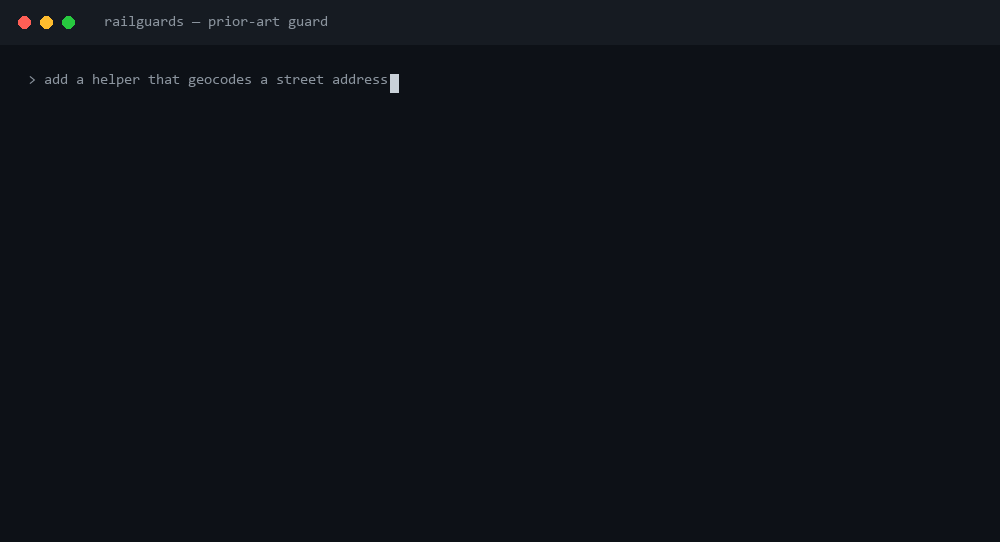

# claude-railguards

Portable extraction of a production code-safety railguard system, so the
same discipline can be dropped into any project.

## What it looks like when it fires

The prior-art guard runs *before* the agent's Write/Edit lands. When the agent
reaches for something the repo already has, the edit is blocked — not warned:



No `prior-art-checked:` line means the write stays blocked. The agent can't
silently duplicate, and every override is logged to `.claude/prior-art-decisions.log`.

## What's in it
The 3 highest-value, lowest-coupling pieces, made config-driven:

| Piece | What it does | Coupling externalized to |
|---|---|---|
| `hooks/prior-art-guard.py` | PreToolUse(Write\|Edit) — blocks re-implementing existing capability; forced `prior-art-checked:` ack | `prior_art.watch_dirs`, `known_sources`, `domain_url_fragments` |
| `scripts/qa_gate.py` | Validates a `.qa_report.json` against the universal schema | `qa_gate.tiers`, `min_break_it`, `require_functions` |
| `skills/pre-impl/SKILL.md` | Pre-implementation investigation protocol (generic, as-is) | none |
| `git-hooks/pre-commit` | Branch guard + secrets scan (keys, DB-url-with-password) + large-file gate | `git_hooks.protected_branches`, `max_file_bytes` |
| `git-hooks/post-commit` | Stamps the commit hash into `.qa_report.json` (no amend) | none |

All project specifics live in **`railguards.config.json`** — nothing project-specific
is reachable in the code.

## Install — as a Claude Code plugin (recommended)
```text
/plugin marketplace add lmcdo/claude-railguards     # this repo
/plugin install railguards@claude-railguards
```
That wires the **Claude-side** railguards (prior-art PreToolUse guard, pre-impl skill,
`/qa-gate` command). Git hooks can't ship in a plugin, so add the **git-side** guards once
per repo:
```bash
install-git-hooks            # from the plugin's bin/, run at your project root
```
Then edit `railguards.config.json` (`prior_art.known_sources`, `git_hooks`).

## Install — without the plugin system (copy + wire)
```bash
./install.sh /path/to/target-project
```
Copies the files under `.claude/railguards/`, seeds `railguards.config.json`, merges the
PreToolUse hook into `.claude/settings.json`, and installs the git hooks (idempotent).

## Layout (marketplace repo)
```
.claude-plugin/marketplace.json      ← lists the plugin (no Anthropic gate; anyone can add)
plugins/railguards/
  .claude-plugin/plugin.json
  hooks/hooks.json + hooks/prior-art-guard.py   ← PreToolUse guard
  skills/pre-impl/SKILL.md                       ← pre-impl gate
  scripts/qa_gate.py + commands/qa-gate.md       ← QA-report gate + /qa-gate
  git-hooks/{pre-commit,post-commit}             ← installed by bin/install-git-hooks
  bin/install-git-hooks  lib/config_get.py  railguards.config.json
```

## Pitfalls when extending these hooks

**`set -e` + capturing a command's exit status.** If a hook uses `set -e` (or you add it
while wiring in a new check), a bare failing command terminates the script immediately —
the next line, which would have read `$?` or `${PIPESTATUS[0]}`, never runs. The hook just
stops silently mid-block; whatever message that check was supposed to print never appears.
It's worse for a tool whose "nothing to report" exit code is non-zero (e.g. exit 2 for "scan
had gaps it couldn't resolve") — a *good* result then aborts the operation the hook was
gating, with no explanation.

Fix: never let the command run bare. Make it part of a compound `set -e` does not trip:
```sh
RESULT=0
some_command_that_might_fail || RESULT=$?
if [ "$RESULT" -ne 0 ]; then
  ...
fi
```
Verify it under the trap that broke it, not by reading the diff back:
```sh
bash -c 'set -e; some_command_that_might_fail; echo unreachable'
```
If `unreachable` doesn't print, the pattern still isn't safe. Each sequential check in a
growing hook (build → lint → tests → ...) needs this independently — fixing the first
check doesn't fix the second.

## Not yet ported (later phases — see plan)
**P2 DONE** (branch guard, secrets scan, large-file gate, hash-stamp). Still to do: bracket-lint
generalization; liability scan, test-baseline ratchet, db-safety, capability index (project-coupled,
P3); pip-package the validators + plugin marketplace manifest (P4).

## Config shape
```json
{
  "prior_art": {
    "watch_dirs": ["/services/", "/src/"],
    "known_sources": ["the", "data-source", "names", "already", "implemented"],
    "domain_url_fragments": ["yourapi.example.com"]
  },
  "qa_gate": {
    "tiers": ["critical", "standard", "minor"],
    "min_break_it":      { "critical": 5, "standard": 3, "minor": 0 },
    "require_functions": { "critical": 1, "standard": 1, "minor": 0 }
  }
}
```
